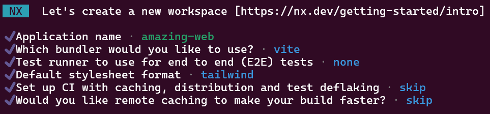

# Creating Repository

```bash
npx create-nx-workspace@latest amazing-ng --preset=react-monorepo
```



# ESLint Configuration

```bash
npx nx generate @nx/eslint:convert-to-flat-config
```

# NestJS API Application

```bash
# required for the next step
npx nx add @nx/node

npx nx generate @nx/node:application --framework=nest --name="amazing-api" --directory="apps/amazing-api" --projectNameAndRootFormat="as-provided" --frontendProject="amazing-web"

# e2e not necessary at the moment
npx nx generate @nx/workspace:remove amazing-api-e2e
```

# GitHub CI

```shell
npx nx generate @nx/workspace:ci-workflow --ci=github
```
